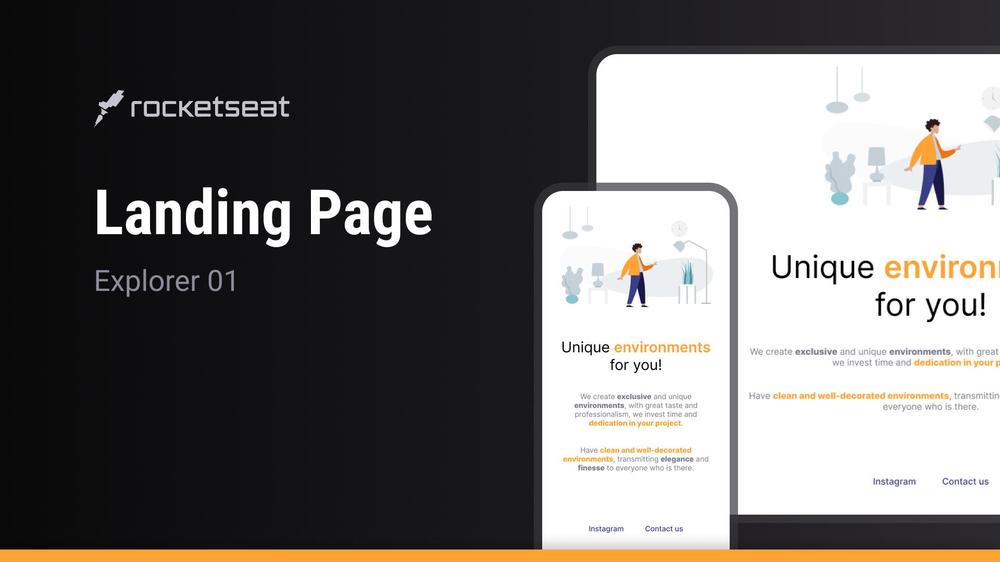

`HTML5` `CSS3` `Git`

This is a Rocketseat challenge to practice and develop my HTML and CSS skills. This is not a professional project. While the creative design of the landing page is not my own, I designed the layout from scratch in Figma following the challenge design to further develop my Figma skills.

- [Deploy link - Netlify](https://landing-page-explorer01-rs.netlify.app/) 🚀
- [Layout and Style Guide - Figma](https://www.figma.com/design/57Wus1PdwPr9ls87Rkcj2r/Landing-Page-%7C-Explorer-01-%7C-Rocketseat?node-id=2-2&p=f&t=5PSTCjPSxWVWR0YI-0) 🖼️
